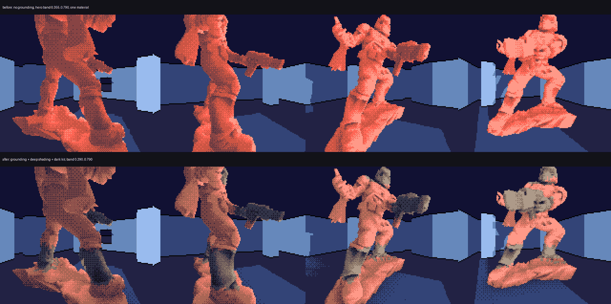
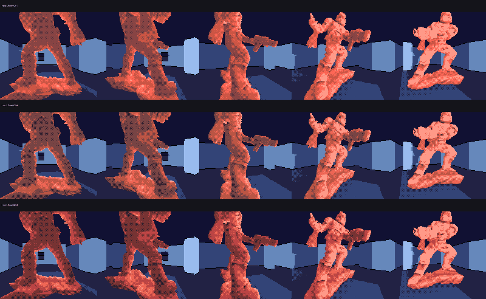
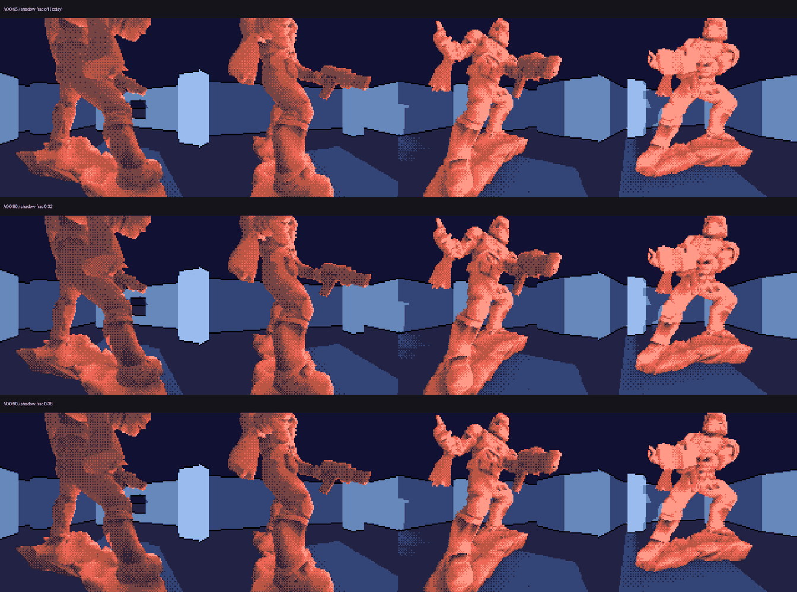

# The classic statue: grounding, deeper shading, and a second material

Status: temporary experiment branch. Not merged. Everything here is opt-in
behind `-DROOM_BUNDLE_DOOMGUY_GROUNDING=1` plus a region file the importer only
reads when it is named; with none of it on, every existing bake is
byte-identical (`tile_loads=5756 scheduled_peak=58 canonical=E4F108D3C424CCE3`
on the floor-mount chamber).

Three things were asked for, against the *original* Doomguy statue rather than
the floral diorama the last two passes were developed on:

1. the same grounding treatment — the silhouette shadow map and the contact
   occlusion from [HERO_GROUNDING.md](HERO_GROUNDING.md);
2. more dynamic range in the shading, so the figure goes darker near its edges;
3. a second, darker material for the boots, helmet and gun.



## The thing that has to be said first

`FullDoomguyclassic-single-notex.glb` carries **no material information at
all**. Not "not much" — none:

| what was looked for | what is there |
|---|---|
| albedo texture | none; no `images`, no `textures` |
| glTF materials | one, `baseColorFactor` `[0.604, 0.604, 0.604, 1]` |
| vertex colours | no `COLOR_0`; attributes are `POSITION`, `NORMAL` |
| sub-meshes to key off | one primitive |
| separate shells | one connected component, after welding 1 481 242
  vertices down to 250 021 |

So the request to match "the orig tex/mat" cannot be honoured as stated, and
the honest options were to invent a segmentation out of geometry and present it
as a measurement, or to author one and say so. This is the second.

The distinction is worth protecting, because the diorama's three materials
*were* measured, out of its texture, by clustering chromaticity — and a reader
six months from now has no way to tell the two apart from the output. So the
importer refuses to take both at once (`--family-regions` and `--hue-families`
are mutually exclusive), the palette report records
`source.kind = "authored-regions"` with the file path, and CI asks the importer
for three materials on this asset and asserts that what comes back is **one
achromatic one with no albedo texture**. The premise is a test, not a comment.

If a textured version of this asset turns up, delete the region file and pass
`--hue-families`; everything downstream is identical.

## Authored regions

A region file is a short list of geometric predicates in the importer's own
normalized space — Z up, base at zero, XY centred, scaled to `--height`, which
is the space the emitted Q8 vertices are in divided by 256. It is readable,
and when it is wrong it is wrong visibly and in one place.

```json
{ "name": "gun", "family": 1, "type": "capsule",
  "a": [0.2, -2.0, 10.9], "b": [3.6, -5.6, 9.2], "radius": 1.8 }
```

Four shapes: `halfspace`, `box`, `sphere`, `capsule`. The capsule is the one
that earns its place beyond the other three — the gun is held diagonally across
the body and runs out to `(3.1, -5.3, 9.3)`, which no axis-aligned anything
bounds without swallowing a leg.

Overlap rule: **later regions win**. That is the whole rule, and it is enough,
because it makes subtraction free (a later region naming the default family
carves a hole in an earlier one) without introducing a second concept.

Two properties make this cheaper than the measured path rather than a
compromise:

- **No transfer step.** An albedo sample is a measurement taken somewhere else
  and has to be carried onto the decimated shell, which is where the diorama's
  material boundaries blur. A region is a predicate that can be asked at any
  point in space, so asking it at the shell's own vertices is exact. Triangle
  coherence comes out at **0.923** against the texture path's 0.882.
- **Resolution independence.** The boundary lands where it was drawn at any
  `--visual-tris`, instead of moving with the decimation.

What it costs is that it can be silently wrong, so the importer refuses a
region that claimed no vertex and a family that ends up with no surface — both
of which otherwise produce a build that looks entirely fine except that a
material is missing.

Measured on this asset: helmet 259 vertices, gun 302, boots 117 + 89; the kit
is **22.1%** of the shell area.

## A family may now be darker

Until this pass every family shared one lightness band, deliberately, and the
comment explaining why is worth restating because it is still true:

> shade already says how lit a pixel is, so if a green leaf and a red petal at
> the same shade level sat at different lightnesses, the family plane would be
> smuggling shading information into the colour channel and the figure's form
> would depend on which material happened to be facing the light.

An **albedo offset** does not do that. It moves a family's whole band by a
constant, so within a family every stop keeps its spacing and its order and the
shading signal is untouched — it is just being read off a darker surface, which
is what a dark material *is*. Black boots really are darker than bright armour
at the same incident angle, and refusing to say so is not neutrality, it is a
wrong albedo.

The clamping is asymmetric on purpose:

- the **top** end takes the offset in full, because the lit side of a material
  is what tells you how dark the material is;
- the **bottom** end stops at `HERO_L_HARD_FLOOR = 0.201`, which is the
  ceiling's lightness and therefore the darkest thing the room draws. Below
  that, with `SEM_BLACK` next door as the "no hero here" code, a shadowed pixel
  stops reading as material and starts reading as a hole punched in the figure.

So a large offset *narrows* the band rather than sliding it out of view — which
is also what a dark material really does, having less reflectance range to
spend. Narrowing is bounded: below `(stops-1) * RAMP_MIN_STEP_L = 0.220` the
stops stop being tonally distinct on 4-bit hardware and the designer fails with
a message naming the material, rather than silently squeezing it.

At the `-0.12` this asset uses:

| family | band | stops |
|---|---|---|
| armour | 0.290 – 0.790 | `51,34,51` `119,68,68` `170,102,85` `221,119,102` `255,153,136` |
| kit | 0.201 – 0.670 | `17,17,34` `51,51,68` `102,85,85` `136,119,102` `153,153,136` |

Two families is also cheaper than three: 2 × 5 = 10 of the 15 usable sprite
entries, against the diorama's exact fill.

## More range for the shading

The second complaint was the most clearly correct of the three, and it had two
separate causes in two different files.

**The palette had nowhere dark to go.** The hero band ran 0.355 to 0.790 — the
darkest hero stop sitting barely below the *darkest wall* at 0.388. Five stops
across a range of 0.435 is not much form, and there is nothing the occlusion
term can do about it: it can rank a pixel into the darkest stop, and the
darkest stop was a mid grey. The floor is now 0.290, clearing the room floor's
0.260 by half a ramp step, for a range of 0.500 — about 15% more lightness to
spend on shape. Swept at 0.355 / 0.320 / 0.290 / 0.250; at 0.250 the mid-tones
darken enough that the figure starts losing its read.



**And the dark end was rationed.** Ramp thresholds are chosen from the object's
own brightness distribution at equal quantiles, which is the right default for
an unknown light rig but also fixes the dark share of the surface at 22.5%
regardless of how creased the model is. `shadow_fraction` is the counterpart to
the existing `highlight_fraction`: it pins the bottom stop's share the way that
one pins the top's, and the stops between them split what is left.

It is a strict generalization rather than a different policy, and that is
checkable: substituting `shadow_fraction = (1 - highlight_fraction) / (L - 1)`
reduces it algebraically to the old formula, so **0.225 is a provable no-op** —
asserted in CI as a byte-identical bake, not argued in a comment.

Raising `ao_strength` 0.65 → 0.80 alongside it changes *which* pixels sort to
the bottom. With equalization on, only the ranking matters, so giving occlusion
more of the ranking is what makes the dark stops land on creases and the rim
rather than merely on the unlit side.



Swept at 0.65/off, 0.80/0.32 and 0.90/0.38. At 0.90 the rocky base collapses
into a single dark mass. Both ride with `ROOM_BUNDLE_DOOMGUY_DEEP_SHADING`,
which defaults to `GROUNDING` because it answers the same complaint about the
same figure.

## The grounding pass transfers unchanged

Nothing in the shadow map or the contact term was asset-specific, and this is
the first evidence of that rather than an assertion:

| | diorama | classic statue |
|---|---:|---:|
| agreement at 512 | 99.44% | 97.80% |
| agreement at 1024 | 99.87% | 99.30% |
| missed cells (under-shadowing) | 0 | **0** |
| over-coverage, 512 → 1024 | shrinks | 564 → **178** |

The one difference is that 512 over-covers more here — 11.6% against the 5% the
diorama needs — which is a property of the asset, not of the algorithm: this
statue has a gun, separated fingers and a rocky base, so it has far more
silhouette per unit of screen. The bound that carries the meaning is
convergence, and it holds: over-coverage shrinks with resolution rather than
drifting, and 1024 reaches the same 5%.

## What it costs

Floor-mount chamber, bundle 11, `ROOM_BUNDLE_SCHEDULER_MAX_UPLOADS=512`:

| | off | on |
|---|---:|---:|
| `tile_loads` | 6749 | 7726 (+14.5%) |
| `scheduled_peak` | 63 | 69 |
| runtime work | — | none; all of it is baked |

The peak rise is the dithered penumbra and the contact gradient turning more
background tiles over as the camera moves, on a chamber already above the
~48/VBlank budget. `CONTACT_STRENGTH` and `SOURCE_RADIUS` trade it back.

Deep shading on its own is 1 tile load out of 7725 — it changes which stop a
pixel lands on, not how many distinct tiles the figure needs.

## The gate that had to change

The colour build was gated on a symmetric bound: no (material, shade) pair may
sit more than one ramp step — 0.062 — from where the greyscale design put it.
That was the right gate while colour promised to be "the greyscale image with
hue added". It is the wrong gate for a palette that deliberately reaches
further down, because it cannot distinguish the two things it exists to catch.

A stop that moved **up**, or two stops that **crossed**, scrambles the tonal
ordering the tile vocabulary was trained against. A stop that moved **down**,
monotonically, with its order intact, is the extra contrast that was asked for
— and bounding it bounds the feature.

So the gate is now signed and split by role:

- the **room** is untouched by any of this and keeps the symmetric 0.062;
- the **hero** is held to the upward half of it, and its downward extent is
  reported as a measurement (0.20 static / 0.19 blend on this asset) with a
  lower bound, so the widening cannot be lost to a clamp and leave the gate
  vacuously satisfied;
- `RAMP_ORDER` checks the crossing case directly, on **every** family — which
  a per-family albedo offset makes a real risk, since family 0 can be perfect
  while family 1 has been shifted into a clamp that flattened it.

`tests/test_recolour_lightness.py` includes a test that the old number is the
same for the safe case and the unsafe one, so the reason for the change is
itself checked rather than remembered.

## Reproduce

```sh
node tools/glb_rmb/convert.mjs \
  assets/gg-hero/FullDoomguyclassic-single-notex.glb \
  tools/generated/doomguy_mesh.inc \
  --name doomguy --height 19 --up z \
  --visual-tris 5200 --shadow-tris 200 --recess-radius 0.5 \
  --family-regions assets/gg-hero/FullDoomguyclassic-regions.json

node tools/glb_rmb/gg_palette_design.mjs \
  tools/generated/doomguy_mesh_palette.json \
  tools/generated/hero_colour_palette

cc -std=c99 -O2 -Wall -Wextra -Wpedantic -Werror \
  -DROOM_BUNDLE_DOOMGUY_GENERATED -DROOM_BUNDLE_DOOMGUY_FLOOR_MOUNT=1 \
  -DROOM_BUNDLE_DOOMGUY_GROUNDING=1 -Isrc -Itools \
  tools/polar_baked_composite.c tools/room_mesh_bake.c \
  tools/room_bundle_poc_gen.c -lm -o /tmp/bake

ROOM_BUNDLE_ONLY=11 ROOM_BUNDLE_SCHEDULER_MAX_UPLOADS=512 \
ROOM_BUNDLE_CAPTURE_REVIEW=1 ROOM_BUNDLE_CAPTURE_OWNER=0 /tmp/bake /tmp/cap

python3 tools/recolour_semantic_frames.py \
  tools/generated/hero_colour_palette.json /tmp/cap /tmp/render \
  --scale 3 --sheet-every 15
```

Knobs worth turning: `--hero-l-floor` (0.290), `--hero-family-lightness`
(`0,-0.12`), `--hero-chroma` (0.68), `-DROOM_BUNDLE_DOOMGUY_AO_STRENGTH`
(0.80), `-DROOM_BUNDLE_DOOMGUY_SHADOW_FRACTION` (0.32), and the region file
itself.

CI: `.github/workflows/doomguy-classic-grounding.yml`.
