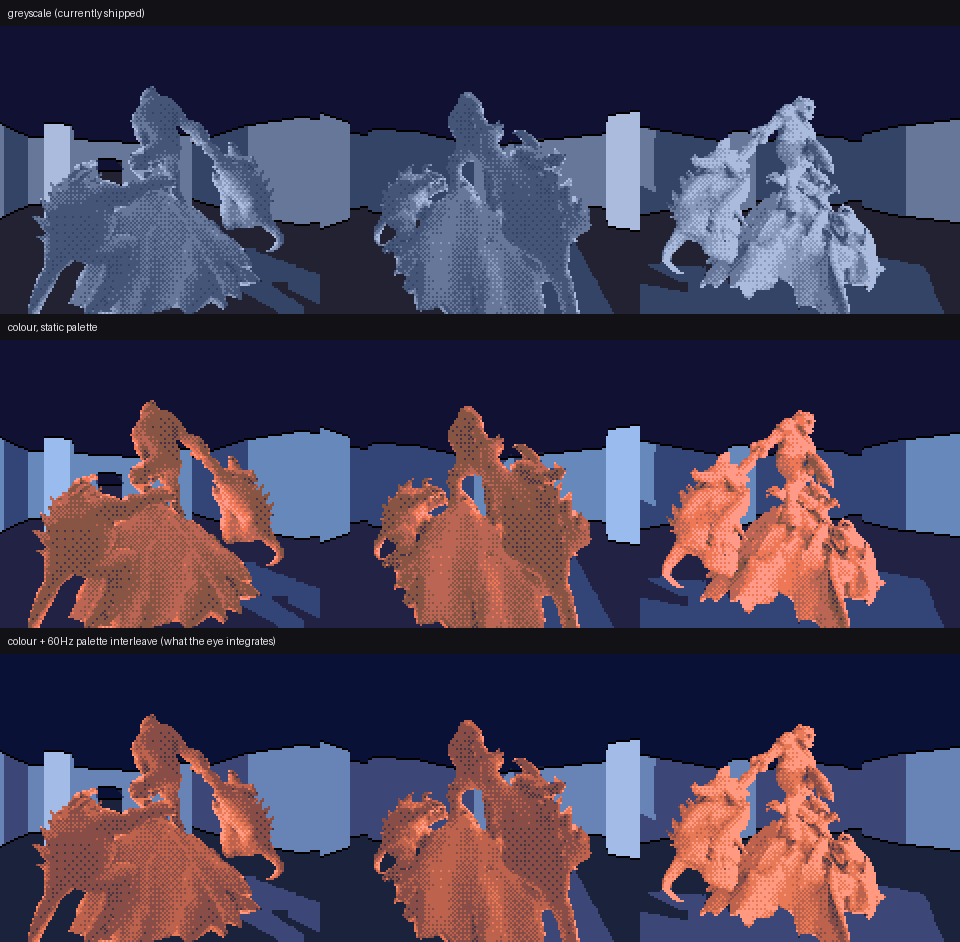
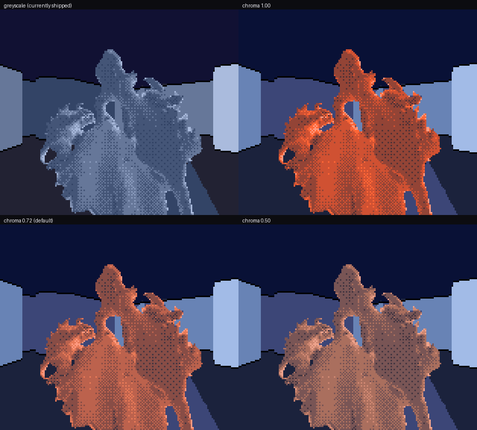

# Colour, for the price of 32 bytes

Status: temporary experiment branch. Not merged. Opt-in at every stage --
`convert.mjs --hue-families` defaults to 0 and `HERO_COLOUR_PALETTE` defaults
to 0, so every other proof in the repository is untouched.

## The short version

Colour on this renderer is a palette-index remapping and nothing else. The
compositor emits the same shade codes it always did, the tile vocabulary is
the same 192 patterns, the sprite attributes are the same, and the mesh
header is byte-identical apart from one comment line. What changes is 48
sixteen-bit palette entries.

That is not a lucky accident, it is the consequence of one measurement: this
asset's base-colour texture is a single hue. The pipeline detects that,
refuses to spend tile bitplanes encoding a material distinction that does not
exist, and paints the compositor's existing five-stop brightness ramp in the
material's colour instead.

## What the asset actually is

`hunyuan_diorama_vertical_112-optimized.glb` carries a 1024x1024 base-colour
texture. Sampled at 96x96 it averages sRGB (87, 23, 8) and every populated
histogram bin is red-dominant: it is a fired-clay terracotta, one material.

Clustering its albedo into four families does find four clusters, and they are
a trap. Their centres sit at Oklab hue angles 34.3, 35.5, 38.5 and 44.6
degrees -- the same hue -- differing in chroma from 0.037 to 0.171. They are
the shadowed and the lit parts of one surface, because an image-to-3D asset
arrives with its lighting painted into the albedo.

Splitting the palette on that would have been actively harmful. The
family-split layout puts two bits of family in tile bitplanes 2-3, which
multiplies the pixel-code alphabet, which grows the tile vocabulary -- to
re-encode shading information the renderer already computes far better from
actual geometry.

### The test that catches it

Chroma that is proportional to lightness is baked shading of one material,
not a second material.

So `materialResidual()` fits chroma as a *vector* proportional to lightness
through the origin and measures what is left. A vector fit rather than a
scalar one, because a blue family and a red family of equal saturation would
leave no scalar residual at all. The threshold is one 4-bit chroma grid step,
so the decision is a property of the hardware rather than a tuned constant:

| quantity | value |
|---|---:|
| chroma-per-lightness fit | (0.242, 0.176) |
| residual after removing it | **0.0149** Oklab |
| one 4-bit chroma grid step | 0.0308 Oklab |

Residual is 2.1x under the threshold, so: mono-ramp. `tests` cover both
directions -- one hue at four lightnesses must read as one material, and a
grey base under a terracotta figure must read as two.

## Where the colour goes

The hero is drawn as sprites and reads the 16-entry sprite palette. The room
is background tiles and reads the two 16-entry BG palettes. They do not
compete. A warm figure in a cool room is not a compromise between two halves
of one palette; it is two independent palettes, and the complementary
staging that makes the figure sit *in* the room rather than on top of it is
free.

The five ramp stops are written at their SEMANTIC indices, which are
`3, 6, 4, 7, 5` in brightness order -- the compositor's enum appends its two
interstitial stops after the original three. A table written `3,4,5,6,7`
would be scrambled. This project has already paid once for confusing those
two orders (a 21x tonal-error regression in the tile quantizer, see
`HERO_LOD_SHADE_METRIC.md`), so the generator writes them by name.

BG palette 1 is not a second colour scheme. It is the same ramp one stop
brighter, which is what the name-table palette-select bit means here, and its
upper half carries the compositor's `v+7` shadow aliases for the shadow side
of a mixed boundary tile. Both are asserted in CI.

## Three things that came out wrong first, and why

**Reproducing the albedo's lightness.** The obvious thing, and wrong. The
renderer already hands the palette a shade level encoding incident light; the
palette's job is to say what colour that level is. Laying five stops around
this asset's genuinely dark clay lightness put four of them into near-black
reds the panel cannot separate -- and the tile quantizer, handed an image with
less tonal content, would have reported a *lower* error while looking worse.
The material contributes hue and saturation. It does not contribute lightness.

**Deriving the lightness band from the room.** The over-correction. Reasoning
that the figure must separate from its background, the hero band was set just
above the room's mid stop -- which squeezed five stops into a bright quarter
of the range and flattened the figure into a hot orange sticker.

The band that works was already in the repository. The shipped
`k_bg_palettes` / `k_sprite_palette` put every ramp stop between Oklab L 0.388
and 0.790 at low, near-constant chroma, with the ceiling (0.201) and floor
(0.260) below them. Those numbers came from looking at the thing on hardware
and nothing about adding colour makes them wrong, so colour keeps them. The
hero gets a little more room at the bottom because a warm hue against a cool
room has a second separation channel the grey build did not have.

**Letting the per-channel clamp handle out-of-gamut colour.** Chroma is pushed
up with lightness, which for a saturated hue walks out of the display gamut.
Clamping red at 15 while green and blue keep climbing does not darken the
colour, it *rotates its hue*: a vivid red highlight silently becomes orange,
and across a five-stop ramp that reads as the material changing between shade
levels. `gamutMapOklab` backs chroma off at constant lightness and hue
instead, spending the error on saturation, which is the invisible axis.

## Does colour cost depth?

It cannot, and this is checked rather than asserted. Depth and shade in this
renderer are carried entirely by lightness, and the tile vocabulary was
trained against a lightness-ordered objective. If the coloured palette puts
every semantic at the lightness the greyscale one did, the coloured image is
the same image with hue added.

Measured over all 120 review frames, per pixel, weighted by how often each
(hero-or-room, semantic) pair actually occurs:

| palette | mean abs dL | max abs dL |
|---|---:|---:|
| colour, static | 0.0159 | 0.0534 |
| colour, interleaved | 0.0142 | 0.0408 |

The greyscale ramp's own tightest adjacent step is 0.062 Oklab L. The mean
displacement is a quarter of that and the worst single case is inside one ramp
stop, so no pixel in the colour build sits where a *different* shade stop
would have put it in the grey build. CI fails if the mean exceeds 0.030 or the
worst exceeds 0.062.

This check earned its keep immediately. The room palette's aerial-perspective
gradient has two halves: a blue push, which is chroma-only and free, and a
lightness flatten toward the ramp's middle, which is not. At the flatten
strength first tried (0.30) the far wall moved 0.0711 -- past a full ramp step,
which is the one thing the guarantee forbids. Held at 0.12 it stays at 0.0534
and the blue half of the cue, which was doing most of the work anyway, is
untouched.

## Saturation is the one taste knob

Everything else here is derived or measured. How saturated the piece should
look is not something a metric settles, so `--hero-chroma` is exposed rather
than buried, and the default of **0.72** was chosen by rendering the sweep and
looking at it:

At full material strength the figure reads as molten rather than as fired
clay, and its internal shading is harder to follow even though the lightness
structure is provably intact. At 0.50 it washes out.

There is also a hard cap underneath the knob, and it is a real hardware
constraint worth naming: a saturated hue has *less usable lightness
resolution* on a 4-bit-per-channel grid than a neutral does. A neutral ramp
moves all three channels together; a saturated red rails its red channel
early and the only way up is through green and blue, which desaturates, so two
adjacent stops end up separated by almost nothing the eye reads as lightness.
The figure keeps its colour and loses its form. `fitRampChroma` reduces chroma
until every adjacent pair of quantized stops clears 0.055 Oklab L -- the
greyscale design's own tightest gap. On this hue at this band the cap does not
bind (it allows 1.00), so 0.72 is taste, not necessity. On a saturated blue it
binds hard, which is what the unit test checks.

## The 60 Hz interleave

Palette RAM is 32 bytes and is rewritten during vblank for free. One tile
pattern upload is 32 bytes for *one tile*. So alternating the palette between
two settings every frame costs, in bandwidth, a single tile's worth of upload
budget -- once, for the whole screen, forever.

What it buys is colour *resolution*, not more shade stops. The eye integrates
the two frames, so an entry can sit between two points of the 4-bit grid and
the addressable set goes from 4096 colours to roughly 4096 squared. That
matters most exactly where a short ramp fails: the dark end, where the grid's
steps are perceptually enormous.

Measured over all twelve stops the design puts on screen -- five hero, five
wall, ceiling and floor:

| | mean stop error (Oklab) |
|---|---:|
| best single hardware colour | 0.0166 |
| interleaved pair | **0.0054** |

67% closer to the designed ramp, for 32 bytes a frame.

Two details make this real rather than a trick:

- The perceived colour is the **linear-light** average of the pair, not the
  average of the palette indices. Averaging indices is a gamma error and comes
  out visibly too dark; there is a unit test for it.
- Flicker is a **luminance** phenomenon. Chroma alternation at 60 Hz on this
  panel is invisible; luminance alternation of more than about one grid level
  is not. So the pair search is constrained by luminance split, which lets it
  reach for large chroma differences -- blending a chromatic stop with a
  neutral to produce a desaturated shadow the grid cannot express on its own,
  which is exactly the trick the brief asked about. Max split across the whole
  design is 1.06 of 15 levels, and CI fails if any pair exceeds the limit. The panel's slow pixel response helps, and is
  not being relied on: the constraint holds on an ideal display too.

## What it costs

| | |
|---|---|
| tile patterns | 0 |
| pixel codes | 0 (same 8-value semantic alphabet) |
| per-vertex mesh data | 0 bytes (mono-ramp emits no hue attribute) |
| VRAM | 0 |
| ROM, static colour | 96 bytes (two palette tables, replacing two) |
| ROM, with interleave | +192 bytes (four more tables) |
| vblank, static | 0 |
| vblank, interleaved | two 32-byte palette writes per frame |

For scale, the hero vocabulary alone is 192 patterns = 6144 bytes. Colour with
the full temporal interleave is 3% of that, and 0.1% of the room's tile data.

The CI ROM job links the greyscale and colour ROMs from **the same object
files** except `main.o` -- the hero vocabulary object, the room dispatch and
every room data bank are literally the same files in both links. The
zero-tile-cost claim is a build dependency, not a sentence.

## Known limits

- Only the mono-ramp layout is wired end to end. `--hue-families` will emit a
  per-vertex family plane for a genuinely polychrome asset, and the palette
  index arithmetic for it is `(family<<2)|shade` with shade 0 collapsing to the
  shared transparent stop -- chosen so the family bits land in tile bitplanes
  2-3 and can be quantized as a separate, much lower-frequency image than the
  shade bits. The compositor does not yet carry that plane, so
  `gg_palette_design.mjs` refuses the layout rather than pretending. Nothing in
  this repository currently has a second material to test it against.
- The interleave assumes the frame loop actually runs at 60 Hz. A dropped
  frame shows one half of a pair for two frame times. On these luminance
  splits that is a barely visible chroma tick, but it is not nothing, and a
  loop that routinely misses vblank should use the static palette.
- The room palette's aerial-perspective gradient leans on the wall semantics
  being distance bands, which they are in this compositor. It would be
  meaningless on a renderer where those stops mean something else.

## Reproduce

    node tools/glb_rmb/palette.test.mjs

    node tools/glb_rmb/convert.mjs \
      assets/gg-hero/hunyuan_diorama_vertical_112-optimized.glb \
      tools/generated/doomguy_mesh.inc --name doomguy --up y --height 12.2 \
      --visual-tris 5200 --shadow-tris 200 --recess-radius 0.5 --hue-families 4

    node tools/glb_rmb/gg_palette_design.mjs \
      tools/generated/doomguy_mesh_palette.json \
      tools/generated/hero_colour_palette

    cc -std=c99 -O2 -Wall -Wextra -Wpedantic -Werror \
      -DROOM_BUNDLE_DOOMGUY_GENERATED -DROOM_BUNDLE_DOOMGUY_FLOOR_MOUNT=1 \
      -Isrc -Itools tools/polar_baked_composite.c tools/room_mesh_bake.c \
      tools/room_bundle_poc_gen.c -lm -o build/colour/bake

    ROOM_BUNDLE_ONLY=11 ROOM_BUNDLE_SCHEDULER_MAX_UPLOADS=512 \
    ROOM_BUNDLE_CAPTURE_REVIEW=1 ROOM_BUNDLE_CAPTURE_OWNER=0 \
      build/colour/bake build/colour/capture

    python3 tools/recolour_semantic_frames.py \
      tools/generated/hero_colour_palette.json \
      build/colour/capture build/colour/render

Game Gear ROM with colour and the interleave:
`-DHERO_COLOUR_PALETTE=1 -DHERO_COLOUR_INTERLEAVE=1` on
`src/main_hero_sprite_lod_flat_room_gg.c`, built by
`.github/workflows/hero-sprite-lod-flat-room-proof.yml`.
