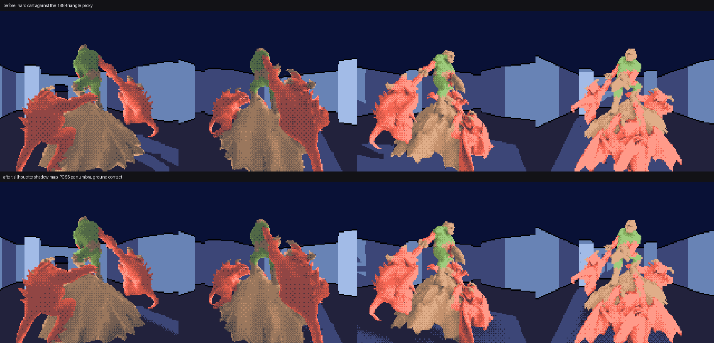
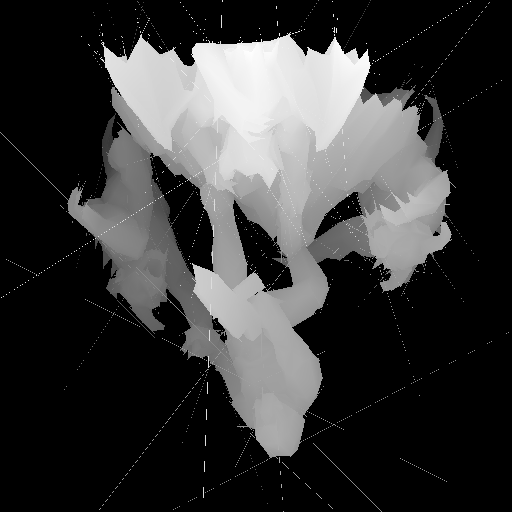
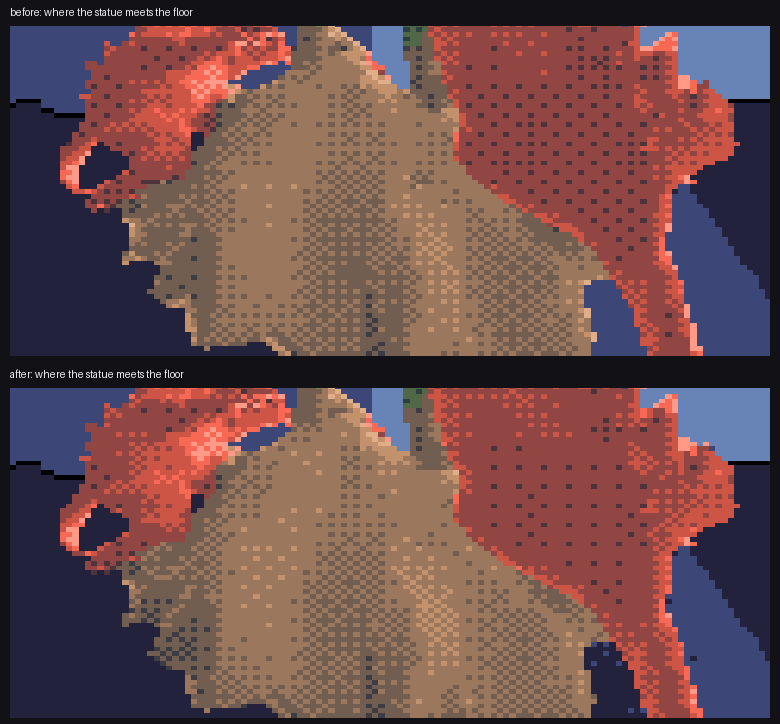

# Making the statue stand on the floor

Status: temporary experiment branch. Not merged. Opt-in behind
`-DROOM_BUNDLE_DOOMGUY_GROUNDING=1`; with it off, this chamber's bake is
byte-identical to what it was (`tile_loads=5756 scheduled_peak=58
canonical=E4F108D3C424CCE3`).

Two complaints, both correct, and they turn out to have one answer each:

- the cast shadow is a blunt polygon under a figure rendered in fine detail;
- the join where the statue meets the floor is a hard line, so the figure
  looks placed on top of the room rather than standing in it.

## Why the shadow was blunt

It was never the shadow of the statue. It was the shadow of a 188-triangle
decimated *proxy*, ray-cast per receiver pixel, one binary visibility test at a
time. The proxy exists because that ray cast is expensive and its cost is
linear in the caster's triangle count: casting the real 5194-triangle visual
mesh the same way takes **660 ms** for a 160x160 floor grid against **75 ms**
for the proxy. Nobody was going to pay that per pixel per frame, so the shadow
got a blob to be the shadow of.

## Rasterise the caster once, from the light

Project the object from a pinhole at the light and keep the result. Building
the map is linear in triangles; every query afterwards is a projection and one
texture read, so the per-receiver cost stops depending on the caster's
complexity *at all*. The expensive thing happens once instead of a million
times, and the trade inverts: the detailed caster becomes the cheap one.

Measured on this chamber, 160x160 floor grid, map at 1024x1024:

| caster | build | exact ray cast | map query | speed-up |
|---|---:|---:|---:|---:|
| 188-triangle proxy | 20 ms | 75 ms | 0.95 ms | **80x** |
| 5194-triangle visual mesh | 91 ms | 660 ms | 1.17 ms | **557x** |

The map stores distance from the light rather than a bare silhouette mask, so
a receiver nearer the light than the caster is correctly left lit -- which a
2D mask could not do.

### It has to be wrong in one direction only

The map approximates the ray cast, and the useful question is not whether they
are identical but which way the error goes. An extra shadowed cell is a
silhouette under one texel too wide -- about 0.03 world units, which nothing at
160x144 can resolve. A *missing* one is a lit speckle inside a shadow and reads
as noise. So conservative rasterisation is used to guarantee the map is a
strict superset of the true shadow:

| dilation (map px) | proxy missed / extra | visual mesh missed / extra |
|---:|---:|---:|
| 0.00 | 7 / 2 | 10 / 13 |
| 0.15 | 1 / 9 | 5 / 25 |
| 0.35 | 1 / 16 | 2 / 50 |
| **0.50** | **0 / 21** | **0 / 91** |
| 0.7072 | 0 / 32 | 0 / 146 |

0.7072 (half a pixel diagonal) is the value that provably covers the centre of
every pixel a triangle overlaps. 0.50 already reaches zero misses on both
casters and over-covers 40% less, so that is what ships. Final agreement at
1024: **99.87%** on the proxy, **99.64%** on the visual mesh, missed = 0 in
both. `ROOM_BUNDLE_SHADOW_SELFCHECK` re-measures this in the bake and fails on
any miss.

### Two bugs found on the way, both invisible in the depth map

The map looked completely plausible while producing a shadow shot through with
lit stripes. Worth recording how each was actually caught.

**The inside test used two different orientations.** The three barycentric edge
functions have to be computed the same way round -- `cross(edge, sample -
edge_start)` for all three. One of them had its operands reversed, which
negates that barycentric, so the "inside" region was a half-plane the triangle
did not occupy. This does not blank the map: neighbouring triangles fill in
each other's wrong halves and the result looks like a solid object with an
aliasing problem. Agreement sat at 94% and, tellingly, got *worse* at higher
resolution. Found by walking the light-to-receiver ray, confirming the
projection was exactly collinear, then asking which triangle the exact cast
hit and discovering its own depth was absent from the pixel it covered.

**The contact region projects to sub-pixel slivers.** The light sits barely
above the floor, so the statue's base is nearly edge-on to it and the whole
contact region lands in light space as slivers a fraction of a texel wide.
Pixel-centre sampling drops them, which punches lit holes exactly where the
object most needs to look planted, radiating outward because that is the
direction the projection magnifies. Expanding each triangle from its centroid
-- the obvious cheap fix -- does nothing here, because on a sliver the centroid
lies *on* the sliver and the offset lengthens it without widening it. The
offset has to be per edge, along that edge's own normal.

## A penumbra that measures itself

With the map in place a soft shadow becomes nearly free, and it is worth having
for a reason beyond looking nicer. The penumbra a disc source casts widens with
the gap between blocker and receiver, so a percentage-closer soft shadow is
*sharp where the object touches the ground and diffuse where it is thrown
across the room*. That gradient is one of the strongest cues that something is
standing on a surface rather than hovering over it, and it comes out of the
geometry rather than being dialled in.

Two passes per query: find how far in front of the receiver the blockers
actually are, then filter over a kernel sized from that distance.

The floor here has exactly **one bit** -- ambient or lit, with no third state --
so the penumbra is expressed as an ordered Bayer dither between them, reusing
the machinery the bonsai chamber already had for foliage.

## The half that does not depend on the light

A cast shadow only anchors the figure on the side the light happens to throw
it. Rotate a quarter turn and it is doing nothing. What holds an object down
from every angle is ambient occlusion in the corner where it meets the floor,
and that needs measuring on both surfaces:

- **on the statue**, the floor occludes its lower surfaces;
- **on the floor**, the statue occludes the floor around its base.

Same physical statement, two receivers. They have to agree or the join reads as
two unrelated smudges instead of one contact.

### An infinite plane would have done nothing

The obvious implementation -- treat the floor as an occluder in the ambient
probe -- produces no gradient at all if you think about it for a moment. An
infinite plane subtends exactly the lower hemisphere from *any* height, so it
occludes every point on a vertical surface equally, and a constant is not a
contact shadow.

The gradient comes entirely from the probe's **finite reach**: a point is
occluded by the floor only while it is close enough for the floor to be within
the probe's radius. That reach is therefore the whole control, and it is not
the same number as the object's self-occlusion radius:

`AO_RADIUS` is 2.5, sized to the statue's own crevices. Using it for ground
contact gives a band 2.5 units tall on a 29.5-unit object -- three screen
pixels, invisible. `GROUND_REACH` is separate and sized to the object. Swept at
4 / 6 / 9 units: 4 barely reads, 9 darkens more than half the skirt, **6** puts
the gradient on the base where the eye looks for it.

## What it costs

| | before | after |
|---|---:|---:|
| host bake, bundle 11 with review capture | 18.4 s | 39.9 s |
| `scheduled_peak` | 58 | 63 |
| `tile_loads` | 5756 | 6207 |
| runtime cost | — | none: all of it is baked |

The bake time is dominated by the floor contact grid (192x192 cells, 24
hemisphere rays each). The one optimisation that mattered was caching the
caster's bounding box: the early-out that rejects the ~95% of floor cells
nowhere near the statue was recomputing that box on every call, so the cheap
path was doing a full pass over the triangle list and the grid took tens of
seconds.

`scheduled_peak` rising from 58 to 63 is the part worth arguing about. It is
already above the roughly 48-pattern/VBlank budget this project measures
against, and the extra 5 come from the dithered floor: the Bayer threshold is
screen-space, so as the camera moves the pattern shifts relative to world
features and more background tiles turn over. `CONTACT_STRENGTH` and
`SOURCE_RADIUS` are the dials that trade it back, and `GROUNDING` off returns
the chamber exactly to 58.

## Everything else is untouched, and that is checked

- With `GROUNDING` off the bake is byte-identical: `tile_loads=5756`,
  `scheduled_peak=58`, `canonical=E4F108D3C424CCE3`.
- No shadow map is built unless a scene asks for one. Built unconditionally it
  moved `tile_loads` to 5759 -- invisible on screen, and exactly the sort of
  drift that makes every older measurement in the repository untrustworthy.
- `rmb_add_indexed_mesh_q8_ex` and `rmb_segment_occluded` keep their old
  behaviour; the exact ray cast is still reachable as
  `rmb_segment_occluded_exact` and is what the map is measured against.
- `tests/test_rmb_shadow_map.c` checks the properties on synthetic geometry
  where the answer is known by hand: never under-shadows, a receiver in front
  of the caster stays lit, a soft source produces genuinely partial coverage
  rather than a step, contact occlusion falls off with distance and is fully
  open far away.

## Also in this pass

Hero chroma default moved from 0.72 to **0.68**, which is where the
three-material palette sits best against this room's cool walls. The sweep that
picked 0.72 was of the single-hue palette, where there was no green to sit
against the red.

## Reproduce

    cc -std=c99 -O2 -Wall -Wextra -Wpedantic -Werror \
      -DROOM_BUNDLE_DOOMGUY_GENERATED -DROOM_BUNDLE_DOOMGUY_FLOOR_MOUNT=1 \
      -DROOM_BUNDLE_DOOMGUY_GROUNDING=1 -Isrc -Itools \
      tools/polar_baked_composite.c tools/room_mesh_bake.c \
      tools/room_bundle_poc_gen.c -lm -o build/tex/bake

    # map against the exact ray cast, plus eyes-on dumps
    ROOM_BUNDLE_SHADOW_SELFCHECK=1024 \
    ROOM_BUNDLE_SHADOW_DUMP=build/tex/map.pgm \
    ROOM_BUNDLE_SHADOW_FLOOR_DUMP=build/tex/floor.pgm \
      build/tex/bake build/tex

    ROOM_BUNDLE_ONLY=11 ROOM_BUNDLE_SCHEDULER_MAX_UPLOADS=512 \
    ROOM_BUNDLE_CAPTURE_REVIEW=1 ROOM_BUNDLE_CAPTURE_OWNER=0 \
      build/tex/bake build/tex/capture

    cc -std=c99 -O2 -Wall -Wextra -Wpedantic -Werror -Isrc -Itools \
      tools/polar_baked_composite.c tools/room_mesh_bake.c \
      tests/test_rmb_shadow_map.c -lm -o build/tex/t && build/tex/t
