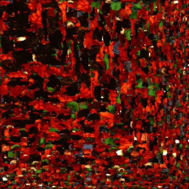
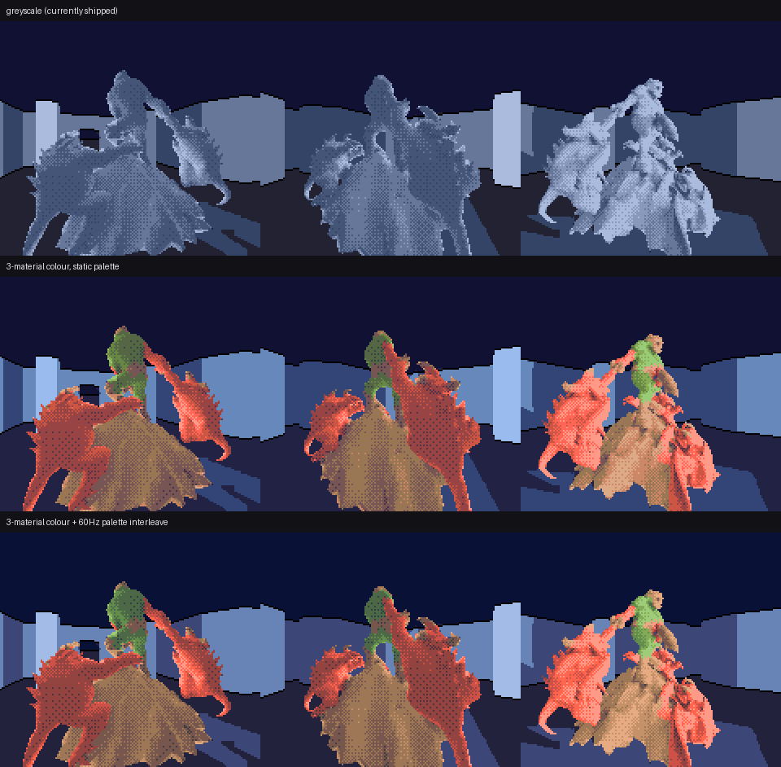
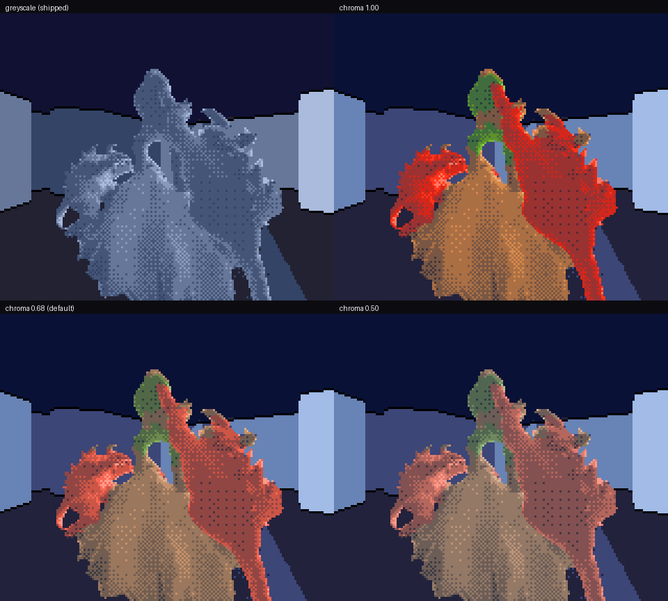

# Three materials, and what the second one costs

Status: temporary experiment branch. Not merged. Opt-in throughout --
`convert.mjs --hue-families` defaults to 0, `build_hierarchical_sprite_lod_pack.py
--families` defaults to 1, and both produce byte-identical output to the
pre-colour pipeline at their defaults.

Follows `HERO_COLOUR_PALETTE.md`, which established that colour is a palette
remapping and that a single-hue asset gets it for 32 bytes. This is what
happens when the asset genuinely has more than one material.

## The correction that started this

The previous pass concluded this asset was one hue -- fired terracotta -- and
built a free single-ramp palette on that basis. **That conclusion was wrong**,
and the way it was wrong is worth recording because the same mistake is easy
to repeat.

The base-colour texture is a red-and-green floral diorama:

Two independent errors hid it.

**The statistics were taken on a downsampled copy.** The texture was resized to
96x96 before its histogram was computed. Red petals and green leaves interleave
at a few texels; a smoothing resize blends them into a muddy brown that is on
neither material, and a coarse histogram bin then reports one hue. Downsampling
destroys exactly the signal a material survey is looking for. Statistics now
run at full resolution, and per-vertex albedo is sampled with a NEAREST texel
rather than bilinearly, for the same reason: filtering across a petal/leaf
boundary invents a colour that is on neither and then lets it vote.

**The clustering ran after a spatial average.** Per-vertex albedo was
transferred onto the decimated shell by averaging colour within the shell's
triangle radius -- which on this asset is many petals and leaves wide. Same
brown, same conclusion. The transfer now carries a *family index* and takes the
area-weighted majority within the radius, never an average: halfway between
"petal" and "leaf" is not a material.

## Families live in chromaticity, not in colour

Clustering the albedo in Oklab directly needs **K=5** before the green foliage
appears as a cluster at all, because the first four clusters spend themselves
splitting the red by lightness. Clustering *chromaticity* -- chroma per unit
lightness -- finds the materials at **K=3**, stably:

| family | surface area | hue | saturation (C/L) | what it is |
|---:|---:|---:|---:|---|
| 0 | 49.7% | 31 deg | 0.38 | red petals |
| 1 | 43.9% | 58 deg | 0.17 | warm tan structure |
| 2 | 6.4% | 131 deg | 0.25 | green foliage |

Dividing lightness out is not a tidying-up step, it is the whole idea.
Lightness is the **shading** channel: the renderer computes its own incident
light, ambient occlusion and creases, and `--shading-source hybrid` already
folds the texture's local darkness into that. A family that meant "dark" would
darken a pixel twice -- once through the shade ramp and again by handing it a
dark palette entry. What is left for a family to carry is precisely what
shading cannot express, which is which material the surface is.

Measured over the whole surface by hue band, weighted by true triangle area:
74.3% red/orange, 16.9% very dark, 3.4% green, 2.5% yellow, 2.6% near-neutral,
0.3% everything else. The green is small and it is real, and it survives onto
the shell: 88.2% of shell triangles have all three corners in one family, so
the segmentation is regions rather than noise.

## The layout: 3 families x 5 shades

Sprite colour 0 is transparent, so the hero has 15 usable palette entries and
3x5 fills them exactly, keeping the compositor's full five-stop brightness
ramp. Four families would have cost every material a shade stop to buy a
fourth material worth well under a percent of the surface -- and shade stops
are what carry shape.

Every family gets the **same lightness band**. That is what makes a family
plane safe to add at all: shade already says how lit a pixel is, so if a green
leaf and a red petal at the same shade level sat at different lightnesses, the
family plane would be smuggling shading into the colour channel and the
figure's form would depend on which material happened to face the light.
Families differ in hue and saturation; they do not differ in lightness. Chroma
*is* fitted per family, because the gamut cap is a per-hue property.

## What it costs

This is the number the decision turns on, and it is measured rather than
argued. Both encodings go through byte-identical tiling, grouping and
dictionary learning -- only `.at()` differs -- so the comparison is between
encodings and not between pipelines.

Mid+far bands, 8 angles, same Lloyd settings:

| encoding | patterns | silhouette error | mean stops wrong | material wrong |
|---|---:|---:|---:|---:|
| shade only | 128 | 6.16% | 0.485 | -- |
| shade only | **192** | **3.68%** | **0.327** | -- |
| shade only | 256 | 1.86% | 0.200 | -- |
| 3 families | 128 | 8.51% | 0.489 | 8.8% |
| 3 families | **192** | **5.24%** | **0.341** | **5.2%** |
| 3 families | 256 | 2.92% | 0.189 | 2.4% |

192 patterns is the hardware ceiling for this VRAM layout (sprite tile id N
reads unified pattern tile 256+N; the name table starts at unified tile 448).

At that ceiling, three materials cost **1.56 points of silhouette error**
(3.68% to 5.24%) and essentially nothing in tone (0.327 to 0.341 mean ramp
stops wrong), and get the material right on 94.8% of hero pixels. Put another
way: the family plane is paid for almost entirely out of silhouette precision,
not out of shading -- the thing that carries form is left alone.

For scale, shade-only at 128 patterns is 6.16% silhouette. So three materials
at the ceiling still reconstruct the shape better than shade-only did with 64
fewer pattern slots; the price is roughly **50 pattern slots' worth of
quality**.

**The third material is nearly free.** Two families cost 5.00% silhouette at
192 against three families' 5.24%. Once a family plane exists at all, the
green foliage -- the most visually distinctive 6% of the model -- costs a
quarter of a point.

Everything else is unchanged: no extra VRAM (the same 192 pattern slots), no
extra per-frame upload bandwidth (a tile is 32 bytes either way), no change to
the room bake, and the palette is still 96 bytes (plus 192 for the temporal
interleave).

## Seen through a real VDP

The host renders above go through the compositor's preview ramp. The ROM job
builds both vocabularies from the same corpus, links a greyscale and a colour
ROM, and runs each in Gearsystem, so the palette is finally indexed by actual
VDP hardware rather than by a Python lookup. That matters here more than it did
for the single-hue pass: the family packing renumbers every hero pixel to
`1 + material*5 + ramp position`, and a pack and a palette that disagreed about
that would look plausible in isolation and wrong together.

Warm pixels (red clearly above both green and blue) can only come from the
sprite palette this change installs, since the greyscale palette is
neutral-to-cool by construction:

| ROM | warm-pixel fraction |
|---|---:|
| greyscale | 0.0000 |
| 3 materials + interleave | 0.1772 |

Both ROMs are 4194304 bytes and both hero vocabularies are 192 patterns /
6144 bytes. The room dispatch and every room data bank are the *same object
files* linked into both, so the room is provably untouched; only `main.o` and
the hero vocabulary differ.

## Saturation

The default stays at 0.72 because that is what keeps the guarantee from
`HERO_COLOUR_PALETTE.md` intact: no pixel may be displaced by a full ramp step
(0.062 Oklab L) from where the greyscale design put it. Measured max
displacement is 0.0534 at 0.72 and **0.0637 at 1.00** -- a 3% overshoot on one
stop, the brightest red, because a saturated red cannot reach the grey ramp's
top lightness inside the gamut and the gamut mapper pulls it down.

Worth knowing, because at full chroma the piece reads considerably better as
flowers. That is a real trade and `--hero-chroma 1.0` makes it, with one stop
landing where the neighbouring stop would have. It is offered, not defaulted.

## Nothing else moved

Every step is guarded rather than asserted:

- The mesh emitted with `--hue-families` differs from a colour-free import by
  one header comment line plus the family array; every geometry array is
  identical.
- The corpus's shade plane and bounding boxes are byte-identical with and
  without a family plane -- verified by baking both and comparing.
- `build_hierarchical_sprite_lod_pack.py --families 1` produces byte-identical
  packs from a corpus with a real family plane and from one whose plane is all
  zeros, so the shipped shade-only path provably ignores it.
- `rmb_add_indexed_mesh_q8_ex` forwards to the new family entry point with
  NULL, so callers that never heard of families are unchanged.
- DHC corpus version 2 is refused by version, not misread, by an older reader;
  a v2 file always carries both planes, so there is no optional path.
- The family plane may not name a material outside the silhouette -- if the
  two planes could disagree about where the hero is, every measurement above
  would be comparing different shapes.

## Reproduce

    node tools/glb_rmb/palette.test.mjs
    python3 -m pytest tests/ -q

    node tools/glb_rmb/convert.mjs \
      assets/gg-hero/hunyuan_diorama_vertical_112-optimized.glb \
      tools/generated/doomguy_mesh.inc --name doomguy --up y --height 12.2 \
      --visual-tris 5200 --shadow-tris 200 --recess-radius 0.5 --hue-families 3

    node tools/glb_rmb/gg_palette_design.mjs \
      tools/generated/doomguy_mesh_palette.json \
      tools/generated/hero_colour_palette

    # cost of the family plane, both encodings, matched budgets
    python3 tools/analyze_hero_colour_codec.py \
      build/tex/host/doomguy_dense_corpus.dhc \
      --palette tools/generated/doomguy_mesh_palette.json \
      --families 3 --bands 2,3 --angles 8 --patterns 128,192,256

    # runtime pack in the family-split alphabet
    python3 tools/build_hierarchical_sprite_lod_pack.py \
      build/tex/host/doomguy_dense_corpus.dhc build/tex/pack-colour \
      --mode flat --angles 32 --flat-patterns 192 --families 3
